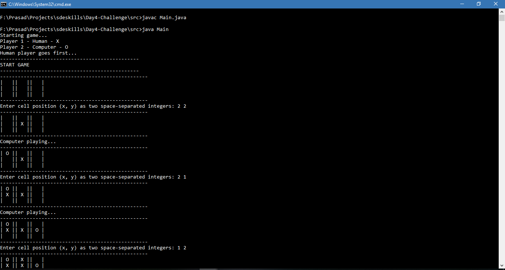
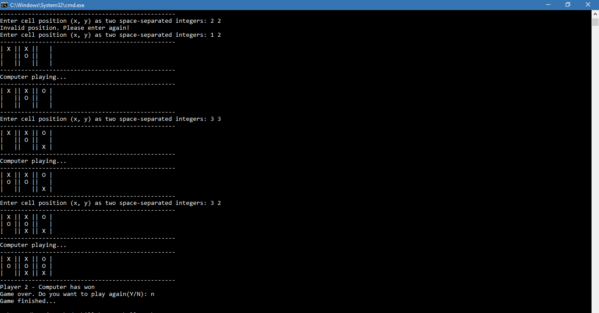

# Tic-Tac-Toe Game with Computer Player


This is a Command-Line base tic-tac-toe game. One player is human and other player is computer.
<br>
The game uses a small AI engine to make decisions while playing the game. The AI-engine is based on the <b>minimax</b> algorithm to make decisions.

## Rules
1. The tic-tac-toe board is a 3x3 matrix(1-indexed). Human player has to give coordinates of the board to make a move.
2. Human player plays first.
3. Human player symbol - X. Computer player symbol - O

# How to use
You need to have 'java' installed in your machine.
<br>
You can either load this repo in any IDE such eclipse of Intellij.
<br>
Otherwise, navigate to the ```src``` directory. Open the terminal and run the following command
```
javac Main.java
java Main
```
Voila! Your game will start.

# Snapshots

<br>
